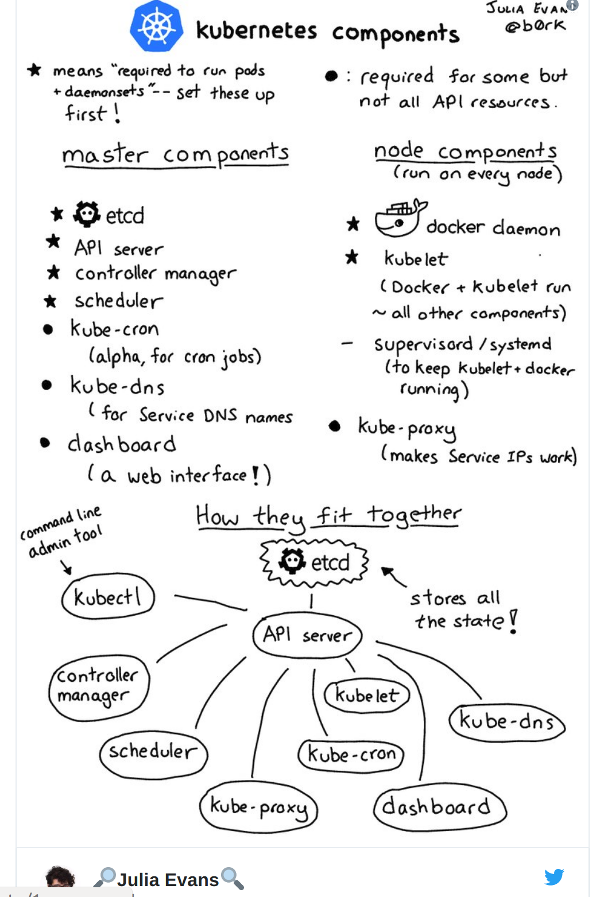

# kubernetes-hello

Kubernetes setup
## Info

Most of the information given below is from the article

https://blog.alexellis.io/kubernetes-in-10-minutes/

### Install kubectl

<code>
curl -LO https://storage.googleapis.com/kubernetes-release/release/v1.9.0/bin/linux/amd64/kubectl
chmod +x ./kubectl
kubectl config view
</code>

### Install Docker

sudo apt install docker.io

### Install Kubernetes apt repo

<code>
sudo apt-get update && sudo apt-get install -y apt-transport-https && curl -s https://packages.cloud.google.com/apt/doc/apt-key.gpg | sudo apt-key add -

echo "deb http://apt.kubernetes.io/ kubernetes-xenial main" | sudo tee -a /etc/apt/sources.list.d/kubernetes.list && sudo apt-get update

sudo apt-get update
</code>

### Install kubelet, kubeadm and kubernetes-cni

sudo apt-get update && sudo apt-get install -y kubelet kubeadm kubernetes-cni

The kubelet is responsible for running containers on your hosts. 
kubeadm is a convenience utility to configure the various components that make up a working cluster
kubernetes-cni represents the networking components.

### Turn off swap

cat /proc/swaps

You can make this permanent by commenting out the swap file in /etc/fstab.

## Broadcast kubernetes API 

ifconfig 

Replace apiserver-advertise-address with your IP

<code>
sudo kubeadm init --pod-network-cidr=10.244.0.0/16 --apiserver-advertise-address=192.168.0.26 --kubernetes-version stable-1.9

[init] Using Kubernetes version: v1.9.5
[init] Using Authorization modes: [Node RBAC]
[preflight] Running pre-flight checks.
	[WARNING FileExisting-crictl]: crictl not found in system path
	[WARNING Service-Docker]: docker service is not enabled, please run 'systemctl enable docker.service'
[certificates] Generated ca certificate and key.
[certificates] Generated apiserver certificate and key.
[certificates] apiserver serving cert is signed for DNS names [pt-xps-13-9350 kubernetes kubernetes.default kubernetes.default.svc kubernetes.default.svc.cluster.local] and IPs [10.96.0.1 192.168.0.26]
[certificates] Generated apiserver-kubelet-client certificate and key.
[certificates] Generated sa key and public key.
[certificates] Generated front-proxy-ca certificate and key.
[certificates] Generated front-proxy-client certificate and key.
[certificates] Valid certificates and keys now exist in "/etc/kubernetes/pki"
[kubeconfig] Wrote KubeConfig file to disk: "admin.conf"
[kubeconfig] Wrote KubeConfig file to disk: "kubelet.conf"
[kubeconfig] Wrote KubeConfig file to disk: "controller-manager.conf"
[kubeconfig] Wrote KubeConfig file to disk: "scheduler.conf"
[controlplane] Wrote Static Pod manifest for component kube-apiserver to "/etc/kubernetes/manifests/kube-apiserver.yaml"
[controlplane] Wrote Static Pod manifest for component kube-controller-manager to "/etc/kubernetes/manifests/kube-controller-manager.yaml"
[controlplane] Wrote Static Pod manifest for component kube-scheduler to "/etc/kubernetes/manifests/kube-scheduler.yaml"
[etcd] Wrote Static Pod manifest for a local etcd instance to "/etc/kubernetes/manifests/etcd.yaml"
[init] Waiting for the kubelet to boot up the control plane as Static Pods from directory "/etc/kubernetes/manifests".
[init] This might take a minute or longer if the control plane images have to be pulled.
[apiclient] All control plane components are healthy after 51.503604 seconds
[uploadconfig] Storing the configuration used in ConfigMap "kubeadm-config" in the "kube-system" Namespace
[markmaster] Will mark node pt-xps-13-9350 as master by adding a label and a taint
[markmaster] Master pt-xps-13-9350 tainted and labelled with key/value: node-role.kubernetes.io/master=""
[bootstraptoken] Using token: c4e5e4.60f269136ab0c5d6
[bootstraptoken] Configured RBAC rules to allow Node Bootstrap tokens to post CSRs in order for nodes to get long term certificate credentials
[bootstraptoken] Configured RBAC rules to allow the csrapprover controller automatically approve CSRs from a Node Bootstrap Token
[bootstraptoken] Configured RBAC rules to allow certificate rotation for all node client certificates in the cluster
[bootstraptoken] Creating the "cluster-info" ConfigMap in the "kube-public" namespace
[addons] Applied essential addon: kube-dns
[addons] Applied essential addon: kube-proxy

Your Kubernetes master has initialized successfully!

To start using your cluster, you need to run the following as a regular user:

  mkdir -p $HOME/.kube
  sudo cp -i /etc/kubernetes/admin.conf $HOME/.kube/config
  sudo chown $(id -u):$(id -g) $HOME/.kube/config

You should now deploy a pod network to the cluster.
Run "kubectl apply -f [podnetwork].yaml" with one of the options listed at:
  https://kubernetes.io/docs/concepts/cluster-administration/addons/

You can now join any number of machines by running the following on each node
as root:

  kubeadm join --token c4e5e4.60f269136ab0c5d6 192.168.0.26:6443 --discovery-token-ca-cert-hash sha256:c32cdae9f5bc71f2e1405836b9602021208930c74c8757c78f52233c9db22703
</code>

### Check the kube system

<code>
kubectl get all --namespace=kube-system
NAME            DESIRED   CURRENT   READY     UP-TO-DATE   AVAILABLE   NODE SELECTOR   AGE
ds/kube-proxy   1         1         1         1            1           <none>          11m

NAME              DESIRED   CURRENT   UP-TO-DATE   AVAILABLE   AGE
deploy/kube-dns   1         1         1            0           11m

NAME                    DESIRED   CURRENT   READY     AGE
rs/kube-dns-6f4fd4bdf   1         1         0         11m

NAME            DESIRED   CURRENT   READY     UP-TO-DATE   AVAILABLE   NODE SELECTOR   AGE
ds/kube-proxy   1         1         1         1            1           <none>          11m

NAME              DESIRED   CURRENT   UP-TO-DATE   AVAILABLE   AGE
deploy/kube-dns   1         1         1            0           11m

NAME                    DESIRED   CURRENT   READY     AGE
rs/kube-dns-6f4fd4bdf   1         1         0         11m

NAME                                        READY     STATUS    RESTARTS   AGE
po/etcd-pt-xps-13-9350                      1/1       Running   0          11m
po/kube-apiserver-pt-xps-13-9350            1/1       Running   0          10m
po/kube-controller-manager-pt-xps-13-9350   1/1       Running   0          11m
po/kube-dns-6f4fd4bdf-jjcc7                 0/3       Pending   0          11m
po/kube-proxy-c9hdn                         1/1       Running   0          11m
po/kube-scheduler-pt-xps-13-9350            1/1       Running   0          11m

NAME           TYPE        CLUSTER-IP   EXTERNAL-IP   PORT(S)         AGE
svc/kube-dns   ClusterIP   10.96.0.10   <none>        53/UDP,53/TCP   11m
</code>

### Packet's Ubuntu installation ships without an unprivileged user-account, so let's add one.

<code>
$ sudo useradd packet -G sudo -m -s /bin/bash
$ sudo passwd packet

sudo su packet
cd $HOME
sudo whoami

sudo cp /etc/kubernetes/admin.conf $HOME/
sudo chown $(id -u):$(id -g) $HOME/admin.conf
export KUBECONFIG=$HOME/admin.conf

echo "export KUBECONFIG=$HOME/admin.conf" | tee -a ~/.bashrc

kubectl apply -f https://raw.githubusercontent.com/gogit/kubernetes-hello/master/kube-flannel.yml

kubectl apply -f https://raw.githubusercontent.com/gogit/kubernetes-hello/master/kube-flannel-rbac.yml

kubectl taint nodes --all node-role.kubernetes.io/master-

kubectl get all --namespace=kube-system

</code>

### Pull Postgres and Elasticsearch images

<code>
	
docker pull docker.elastic.co/elasticsearch/elasticsearch-oss:6.2.3
docker pull postgres

</code>

### Create a pod

<code>

kubectl create -f test-pods.yaml 

pod "www" created

$ kubectl get pods
NAME      READY     STATUS    RESTARTS   AGE
www       2/2       Running   1          18s

curl -X GET http://localhost:9200
{
  "name" : "oFAvtzc",
  "cluster_name" : "docker-cluster",
  "cluster_uuid" : "ws-zYF3WR4ucm2JbeUJJuA",
  "version" : {
    "number" : "6.2.3",
    "build_hash" : "c59ff00",
    "build_date" : "2018-03-13T10:06:29.741383Z",
    "build_snapshot" : false,
    "lucene_version" : "7.2.1",
    "minimum_wire_compatibility_version" : "5.6.0",
    "minimum_index_compatibility_version" : "5.0.0"
  },
  "tagline" : "You Know, for Search"
}

</code>

### References

